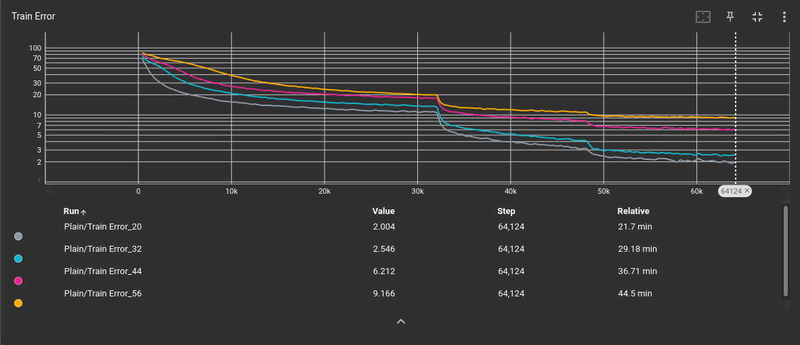
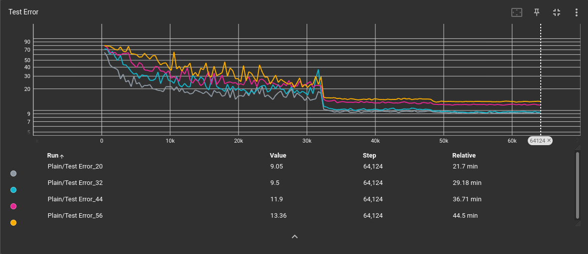
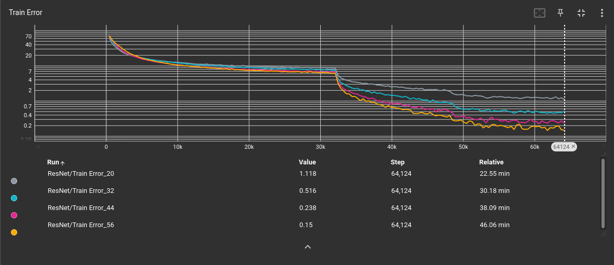
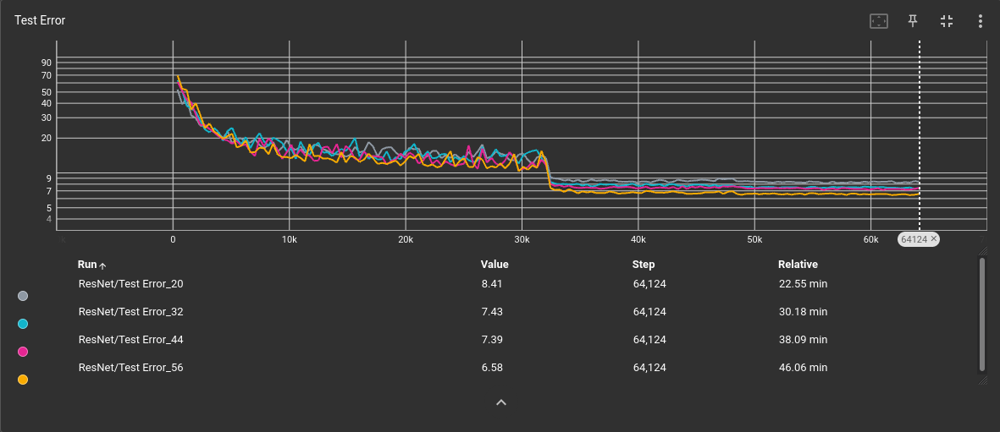

# Multi-GPU-Training-On-AWS
<b>Implementation</b>

My code in <a href=https://github.com/redonovan/Multi-GPU-Training-On-AWS/blob/main/resnet2.py>resnet2.py</a> is a modification of my ResNet <a href=https://github.com/redonovan/ResNet/blob/main/resnet.py>implementation</a> designed to run on multiple GPUs on a single compute node.  My code, written in PyTorch 1.11.0, uses <a href=https://pytorch.org/docs/master/generated/torch.nn.parallel.DistributedDataParallel.html>DistributedDataParallel</a> from the <a href=https://pytorch.org/tutorials/beginner/dist_overview.html>torch.distributed</a> package to implement multi-process parallelism.  Instructions for running the code on a 4-GPU Amazon Web Services (AWS) Elastic Compute Cloud (EC2) g4dn.12xlarge instance are given as comments at the top of the code.  As shown in the TensorBoard plots below, the results are very similar to those of the single-GPU implementation in my ResNet <a href=https://github.com/redonovan/ResNet>repo</a>.  The difference is that the 4-GPU version runs 2.93x faster than the 1-GPU version (all timings on AWS EC2 Tesla T4 GPUs).

As before, it required several attempts to find a random seed to get the 56-layer ResNet to work this well.
